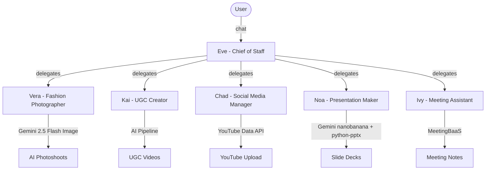
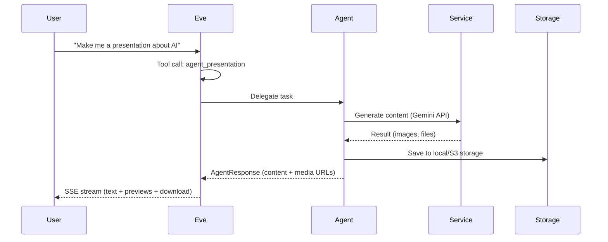

# Teems

**Your AI Creative Team, One Conversation.**

It gives you a full AI creative team photographer, video creator, social media manager, presentation designer, meeting assistant all coordinated by one Chief of Staff named **Eve**.

## Architecture



## Agent Pipeline



## Meet the Team

| Agent | Role | Tech Stack | Status |
|-------|------|-----------|--------|
| **Eve** | Chief of Staff / Orchestrator | Gemini 3 Flash, tool calling, memory | Live |
| **Vera** | Fashion Photographer | Gemini 2.5 Flash Image, multi-turn chat | Live |
| **Kai** | UGC Video Creator | AI avatars, ElevenLabs, lip-sync | Live |
| **Chad** | Social Media Manager | YouTube Data API v3, OAuth 2.0 | Live |
| **Noa** | Presentation Maker | Gemini nanobanana, python-pptx | Live |
| **Ivy** | Meeting Assistant | MeetingBaaS, calendar sync |Live |

## Quick Start

```bash
# Install dependencies
pip install -r requirements.txt

# Configure environment
cp .env.example .env
# Edit .env with your API keys (GEMINI_API_KEY required)

# Run
python main.py
# Open http://localhost:8000
```
